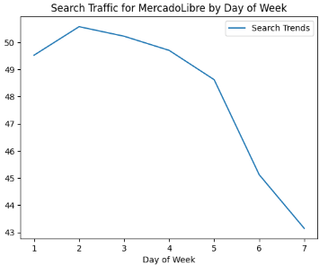
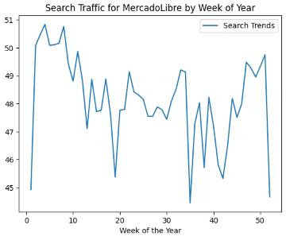
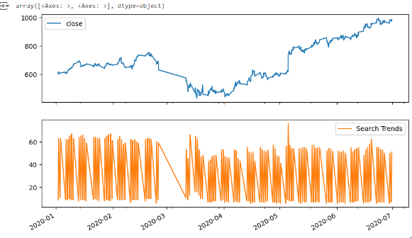
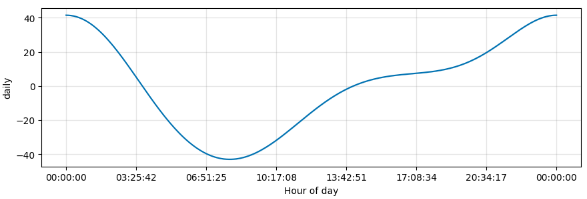

# Forecasting Net Prophet

**Case Study for MercadoLibre**

With over 200 million users, MercadoLibre is the most popular e-commerce site in Latin America. Analyze the company's financial and user data in clever ways to make the company grow.

Find out if the ability to predict search traffic can translate into the ability to successfully trade the stock.

* **Step 1: Find unusual patterns in hourly Google search traffic**
* **Step 2: Mine the search traffic data for seasonality**
* **Step 3: Relate the search traffic to stock price patterns**
* **Step 4: Create a time series model with Prophet**

#### Step 1: Find Unusual Patterns in Hourly Google Search Traffic

Investigate if the Google search traffic for the company links to any financial events at the company.   Does the search traffic data just present random noise?  Identify any unusual patterns in the Google search data for the company, and connect them to the corporate financial events.

**Question:** Did Google search traffic increase during the month that MercadoLibre released its financial results?

* **Answer:** Yes, search traffic for May 2020 was 38,181 higher than the monthly median of 35,172.

#### Step 2: Mine the Search Traffic Data for Seasonality

Use the hourly search data, too and determine if this can be used to track and predict interest in the company and its platform for any time of day.  If so, marketing efforts can be focused around the times that have the most traffic, achieving greater return on investment (ROI) from the marketing budget.

Mine the search traffic data for predictable seasonal patterns of interest in the company.

**Question:** Are there any time based trends that you can see in the data?

* **Answer:**  For Hour of the day, it appears searches drop off after the beginning of the day and ramp down until early morning, about the 8th hour of the day.

Regardless, searches drop off from beginning of the day until about the 8th hour, then slowly ramp back up, the rate slowing around the 15th-18th hour 	of the day (possibly commute time, returning home from work?) and climbing again from 20th hour to 24th hour.

Searches by Day of the week seem to start high on Day 1 (Monday), peaking on Day 2 (Tuesday) and slowly ramping down until Friday, then dropping more steeply on Saturday and Sunday.

Searches for Week of the Year start low / drop drastically in the Dec/Jan time frame (Weeks 51 - 01), which is typically the holiday season.  Peaks are seen at around week 4 (late January), then dropping overall (with slightly erratic ups and downs), dipping greatly around week 19 (early May) and again week 35 (late August).

In the U.S., this coincides with Memorial Day / start of Summer and Labor Day / end of Summer.  This could be related to children being home from 	school / returning to school and/or holiday/vacation schedules for people.

**Question:**  Does the search traffic peak at a particular time of day or is it relatively consistent?

* **Answer:** The search traffic peaks at the end of the day (ramping up from 10th hour, slowing rate of increase around 15th hour, then ramping back up to the max from 20th to 24th hour.

**Question:** Does the search traffic get busiest on any particular day of the week?

* **Answer:**  Search traffic starts high on the 1st day of the week, peaking on the second day. For the duration of the week there is a slow decline, until the 5th day of the week, where search traffic rate of decrease is more steep.

**Question:**  Does the search traffic tend to increase during the winter holiday period (weeks 40 through 52)?

* **Answer:** There is an increase, beginning week 50 through week 51-51.  The increase/spike is seen again in the first 4 weeks of the year, where there is a drastic increase up through about week 8-10.  At this point, there is a slide down until about week 20, where another increase occurs.

#### Step 3: Relate the Search Traffic to Stock Price Patterns

Determine if there is a relationship between the search data and the company stock price.

**Question:** Market events emerged during the year of 2020 that many companies found difficult. But, after the initial shock to global financial markets, new customers and revenue increased for e-commerce platforms.  Do both time series indicate a common trend consistent with this narrative?

* **Answer:** There was a drastic drop in both Search Trends and Stock Price starting late February 2020 and bottoming out around mid-March 2020.

From mid-March forward, there was a gradual increase in Search Trends, picking up a week into May, and continuing until the end of the period (July 2020).

After the drop, from mid-March, there was a quick recovery/increase of Stock Price, dropping slightly into the end of March, then remaining fairly steady over the next few months.

While Search Trends continued to trend higher than prior to the events of Feb/March 2020, stock price returned to it's pre-event value (approximately) and remained fairly steady. Search Trends suggest increased interest in the company, but Stock Price did not really support the 'increased revenue/customers narrative.

**Question:** Does a predictable relationship exist between the lagged search traffic and the stock volatility or between the lagged search traffic and the stock price returns?

* **Answer:** A 'good' correlation would be either +0.6 and higher or -0.6 and lower.
  The correlations here are quite weak: very close to 0, or showing no reaction of one variable to the others.

#### Step 4: Create a Time Series Model with Prophet

Produce a time series model with Prophet to analyze and forecast patterns in the hourly search data.

**Question:** How's the near-term forecast for the popularity of MercadoLibre?

* **Answer:** There appears to be a drop/dip coming in Searches/Popularity based on Searches over the next 80 days.

**Using plots of individual time series components**:

**Question:** What time of day exhibits the greatest popularity?

* **Answer:** Time of day that exibits greatest popularity is 00:00, midnight.

**Question:** Which day of week gets the most search traffic?

* **Answer:** Tuesday sees the most search traffic.

**Question:** What's the lowest point for search traffic in the calendar year?

* **Answer:** Lowest point of the year for search traffic is Late December, early January, end of the holiday season.

---
